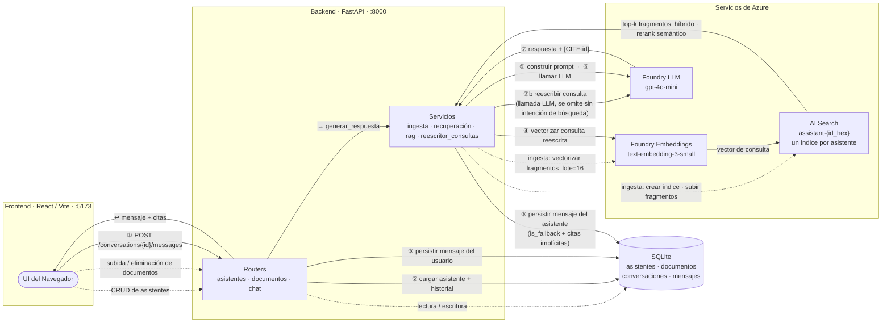

# Plataforma de Asistentes RAG

Una plataforma *full-stack* de Generación Aumentada por Recuperación (RAG) que te permite crear múltiples asistentes de IA aislados, cada uno fundamentado en su propio conjunto de documentos, con memoria conversacional persistente y citas estructuradas.

Una construcción enfocada, a nivel de producción, entregada en 7 días sobre **Azure AI Foundry** y **Azure AI Search**, con un backend en **FastAPI** y un frontend en **React**.

🇬🇧 *También disponible en inglés: [README.md](README.md)*

---

## Qué hace

- **Crear asistentes** — cada uno con un nombre, instrucciones de sistema personalizadas y una base de conocimientos aislada.
- **Subir documentos** — los archivos PDF, DOCX, PPTX, TXT y MD se analizan, fragmentan (*chunking*), vectorizan (*embedding*) y almacenan en un índice dedicado de Azure AI Search por asistente.
- **Chatear con citas** — cada respuesta está fundamentada en los documentos del asistente. Los marcadores en línea `[1]`, `[2]` enlazan a tarjetas de citas expandibles que muestran el documento de origen, la página y el fragmento relevante.
- **Memoria persistente** — las conversaciones se almacenan en SQLite. Recarga la página, reinicia el servidor, reinicia la máquina: tu conversación continúa exactamente donde la dejaste.
- **"No lo sé" por diseño** — si la recuperación no devuelve fragmentos relevantes, nunca se llama al LLM. En su lugar, se devuelve un mensaje informativo preprogramado.

---

## Por qué es importante

### El problema

Las organizaciones y los profesionales acumulan grandes volúmenes de documentación interna —normativas, contratos, manuales, procedimientos, fichas de productos— que sus equipos rara vez consultan porque es lenta de buscar y está dispersa en distintas unidades de red. El conocimiento crítico acaba atrapado en PDFs en lugar de ser accesible como una conversación. La incorporación de nuevos empleados (*onboarding*) crea cuellos de botella en el personal senior que responde a las mismas preguntas una y otra vez. Y cuando los equipos *sí* recurren a chatbots de propósito general en busca de ayuda, estos inventan respuestas que suenan plausibles pero que son incorrectas sobre los mismos documentos que rigen el negocio: una alucinación sobre una normativa fiscal cuesta dinero; una sobre un protocolo clínico puede costar más.

### Quién tiene este problema

Los profesionales que más necesitan una IA fiable son aquellos que menos pueden permitirse una respuesta inventada: firmas fiscales y legales, equipos de cumplimiento y riesgos, departamentos de RRHH que interpretan políticas internas, soporte técnico que maneja preguntas repetitivas de manuales de productos, brókeres hipotecarios que rastrean condiciones de productos cambiantes entre bancos asociados, operadores fintech en flujos de trabajo regulados, equipos de ingeniería que incorporan nuevas contrataciones en grandes bases de código. El patrón común es *conocimiento específico en evolución que no admite errores*.

### Por qué el ChatGPT genérico no es suficiente

ChatGPT no conoce los documentos privados de la empresa, no puede citar fuentes verificables, mezcla el conocimiento de distintos dominios sin separación entre (por ejemplo) un asistente fiscal y un asistente de ventas, está congelado en su fecha de corte de entrenamiento por lo que no puede reflejar normativas actualizadas y, para muchas organizaciones, no es un destino viable para documentos confidenciales bajo el RGPD o reglas de privacidad específicas del sector.

### Cómo aborda esto este proyecto

Este proyecto no es un producto vertical terminado, pero implementa las primitivas arquitectónicas que esos productos necesitan:

- **Bases de conocimiento aisladas por asistente** — un índice dedicado de Azure AI Search por asistente, no un índice compartido con filtros. La contaminación cruzada es estructuralmente imposible (ver *Decisiones clave de diseño §1*).
- **Citas verificables en cada respuesta** — documento, página y texto exacto del fragmento, expuestos en la interfaz como píldoras expandibles para que los usuarios puedan auditar las respuestas contra la fuente.
- **Honesto sobre las lagunas** — un "No lo sé" explícito cuando la recuperación no devuelve nada relevante, en lugar de inventar (ver *Decisiones clave de diseño §3*).
- **Memoria conversacional que maneja seguimientos** — preguntas referenciales como "amplía el punto 2" o "¿qué pasaría si fuera el otro caso?" funcionan de forma natural, a través de la reescritura de consultas basada en LLM (ver *Decisiones clave de diseño §2*).
- **Multilingüe** — respuestas en el idioma del usuario independientemente del idioma del documento.
- **Autoalojable en el propio inquilino (*tenant*) de Azure de la organización** — los documentos nunca salen de él.
- **Adaptable sin reentrenamiento** — cambia la base de conocimientos subiendo o eliminando documentos. Sin *fine-tuning*, sin canalizaciones de *Machine Learning*.

### Casos de uso concretos

Una firma fiscal sube el código tributario actual y los manuales de Hacienda, y el asistente responde a las preguntas de los clientes con citas al artículo aplicable. Un equipo de RRHH convierte un manual del empleado de 200 páginas en un asistente que gestiona consultas sobre vacaciones, beneficios y trabajo en remoto. Un operador fintech regulado dota a las operaciones de primera línea de un asistente de cumplimiento que cubre los procedimientos internos de KYC/AML. Un proveedor de software reduce los tickets de soporte repetitivos con un asistente que conoce la documentación de la API y los patrones de casos comunes. Un bróker hipotecario tiene un asistente que cubre las condiciones hipotecarias actuales de cada banco asociado, disponible durante la llamada con el cliente. Un equipo de ingeniería reduce el tiempo hasta la primera contribución con un asistente que conoce la documentación interna del código base.

### Lo que NO es

No es una búsqueda federada a través de todos los SaaS de la empresa; solo se pueden buscar los documentos subidos explícitamente. No reemplaza al experto humano en decisiones críticas; es un acelerador, no un sustituto. No tiene conocimiento más allá de los documentos subidos; si no se sube un libro de cocina, no hay recetas. En esta versión no procesa imágenes ni audio (sin OCR, sin conversión de voz a texto). No tiene control de acceso por usuario en el MVP, lo cual está documentado como una limitación conocida. Y deliberadamente no es un producto empresarial listo para usar.

Lo que *sí* es, es una base técnica sólida para productos verticales construidos sobre ella: las mismas primitivas, especializadas para un dominio.

---

## Capturas de pantalla y Demo

**Estado vacío — selector de asistentes**


La vista inicial muestra la barra lateral persistente de asistentes a la izquierda (con el botón `+ New`) y un estado vacío centrado en el panel principal que pide al usuario que seleccione o cree un asistente. El interruptor de modo oscuro/claro se encuentra en la esquina superior derecha del encabezado.

**Diálogo de creación de asistente**


Un modal de shadcn/ui recopila los tres campos necesarios para instanciar un asistente: un nombre, una descripción opcional (que se muestra como el subtítulo de la barra lateral) y un bloque de formato libre de `Instrucciones` que se convierte en el *prompt* del sistema del asistente. Al enviar el formulario, se crea atómicamente la fila de SQLite y el índice dedicado de Azure AI Search.

**Detalle del asistente — instrucciones, documentos, conversaciones**


La vista de detalles expone las instrucciones del asistente, un cargador de documentos de arrastrar y soltar (*drag-and-drop*), y la lista de documentos indexados. Cada tarjeta de documento muestra su nombre de archivo, fecha de ingesta y una insignia de estado `Indexed` que confirma que los fragmentos han sido vectorizados y subidos al índice de Azure AI Search de ese asistente. Las acciones de editar y eliminar se encuentran en el encabezado.

**Lista de conversaciones**


Debajo del bloque de documentos, el historial de conversaciones del asistente se enumera cronológicamente. Cada conversación se almacena en SQLite con todos sus mensajes, citas y banderas `is_fallback`; al seleccionar una, se reanuda el chat exactamente donde se dejó.

**Chat con citas y memoria conversacional**


El primer turno muestra una pregunta sustantiva respondida con una respuesta fundamentada y una píldora de cita `[1]`. El segundo turno ("Puedes expandir un poco más acerca de esto último?") es un seguimiento referencial: el reescritor de consultas resuelve "esto último" contra el turno anterior antes de que se ejecute la recuperación, de modo que la elaboración se mantiene en el tema en lugar de desviarse.

**Elaboración en múltiples turnos**


Un tercer turno ("Muchas gracias. Puedes también ponerme más ejemplos") activa el modo de elaboración EJEMPLIFICAR: el LLM genera ejemplos adicionales fundamentados en el mismo contexto recuperado, adjuntando nuevamente una píldora de cita `[1]`.

**Píldora de cita expandida**


Al hacer clic en una píldora `[1]` se abre un *popover* que muestra la cita estructurada: nombre del documento de origen (`BOE-IMPUESTO-SOBRE-EL-VALOR-AÑADIDO-...pdf`), número de página y el texto exacto del fragmento recuperado del índice de Azure AI Search. El texto del fragmento se muestra literalmente, sin reescritura por parte del LLM, para que el usuario pueda verificar la respuesta con la fuente.

**Pruébalo tú mismo** — clona el repositorio, introduce tus credenciales de Azure y tendrás tu propio asistente fundamentado ejecutándose localmente en menos de cinco minutos.

---

## Estadísticas

| Métrica | Valor |
|--------|-------|
| Commits totales | 57 |
| Líneas de código (LOC) Backend Python | 2.632 |
| Líneas de código (LOC) Frontend TypeScript / TSX | 1.499 (88 `.ts` + 1.411 `.tsx`) |
| Líneas de código (LOC) Docs Markdown | 2.157 |
| Archivos de test | 8 |
| Tests unitarios | **56 pasados, 0 fallados, 0 omitidos** (27 s) |
| Errores encontrados y solucionados en la auditoría de la Fase 6 | 9 de 9 (B1–B9, ver *Limitaciones conocidas*) |

---

## Arquitectura



### Componentes

| Capa | Tecnología | Rol |
|-------|-----------|------|
| Frontend | React 18 + Vite + TypeScript + Tailwind + shadcn/ui | SPA de tres vistas (asistentes, detalle, chat) |
| Backend | FastAPI + SQLAlchemy + SQLite | API REST, orquestación RAG, persistencia |
| Embeddings | Azure AI Foundry — `text-embedding-3-small` | Vectores de fragmentos y consultas (1536 dims) |
| LLM | Azure AI Foundry — `gpt-4o-mini` | Generación de respuestas y reescritura de consultas |
| Almacén vectorial | Azure AI Search | Búsqueda híbrida con reranking semántico, un índice por asistente |

### Flujo de solicitud de chat

1. `POST /api/conversations/{id}/messages` llega al enrutador de FastAPI.
2. El enrutador carga el asistente (instrucciones, nombre del índice) y los últimos 10 mensajes de conversación desde SQLite.
3. El mensaje del usuario se persiste inmediatamente.
4. **Reescritura de consultas** (paso ③b): si hay un historial de conversación previo, una llamada económica al LLM reescribe el mensaje del usuario en una consulta de búsqueda autosuficiente: resolviendo pronombres, referencias y seguimientos como "cuéntame más sobre el punto 2". Si el mensaje es una charla casual (*chit-chat*, sin intención de búsqueda), la recuperación se omite por completo.
5. **Recuperación**: se vectoriza la consulta reescrita → búsqueda híbrida (palabra clave + vector + reranker semántico) contra el índice de Azure AI Search del asistente → se descartan los resultados por debajo del umbral de puntuación.
6. Si cero fragmentos superan el umbral: se devuelve la respuesta preprogramada de "No lo sé". No se realiza llamada al LLM.
7. **Construcción del *prompt***: *prompt* del sistema (instrucciones del asistente + reglas de comportamiento RAG) + mensajes de conversación previos + bloque de contexto recuperado.
8. **Llamada al LLM**: `gpt-4o-mini` genera la respuesta, citando fragmentos como `[CITE:chunk_id]`.
9. **Posprocesamiento**: los marcadores `[CITE:id]` se reemplazan por etiquetas `[1]`, `[2]`; cada una se resuelve en un objeto de cita estructurado. Si el LLM olvidó citar a pesar de tener contexto, los 3 fragmentos principales recuperados se exponen como fuentes implícitas (`implicit: true`).
10. El mensaje del asistente (con citas y la bandera `is_fallback`) se persiste y se devuelve al frontend.

---

## Stack tecnológico

### Backend

- **Python 3.11+**
- **FastAPI** — framework asíncrono, validación con Pydantic, documentación OpenAPI automática.
- **SQLAlchemy 2.x** + **SQLite** — persistencia relacional para asistentes, documentos, conversaciones y mensajes.
- **openai** SDK — cliente de Azure AI Foundry (LLM + embeddings).
- **azure-search-documents** — cliente oficial de Azure AI Search.
- **pypdf**, **python-docx**, **python-pptx** — extractores de texto específicos por formato.
- **langchain-text-splitters** — Solo `RecursiveCharacterTextSplitter`. Ningún framework completo.

### Frontend

- **React 18** + **Vite** — SPA con recarga en caliente (*hot reload*).
- **TypeScript** — modo estricto.
- **Tailwind CSS v3** — estilizado basado en utilidades.
- **shadcn/ui** — Dialog, Button, Card, Input, Sonner toast.
- **lucide-react** — iconos.
- **axios** — cliente HTTP.
- **next-themes** — modo oscuro/claro con persistencia en `localStorage`.

---

## Decisiones clave de diseño

### 1. Aislamiento estructural de índices (no basado en filtros)

Cada asistente tiene su propio índice de Azure AI Search llamado `assistant-{id_hex}`. No hay un índice global compartido con filtros `assistant_id`.

**Por qué**: un error en un filtro contamina silenciosamente todas las respuestas. Un error en el nombre del índice falla de forma ruidosa y evidente. El índice por asistente también hace que la demostración de aislamiento sea trivial: cambia al asistente B y haz una pregunta sobre los documentos del asistente A; devuelve "No lo sé" porque el índice no contiene tales fragmentos.

*Fuente*: `CONSTITUTION.md` §1, `services/assistant_service.py` (creación temprana del índice al crear el asistente, atómica con la fila de SQLite).

### 2. Reescritura de consultas basada en LLM para seguimientos

Antes de la recuperación, una llamada dedicada al LLM reescribe el mensaje actual del usuario en una consulta de búsqueda independiente, utilizando los últimos 4 mensajes de la conversación como contexto.

**Por qué**: un seguimiento referencial como "cuéntame más sobre el punto 2" se vectoriza sin ninguna señal sobre el tema. El vector sin procesar recupera fragmentos irrelevantes, y la respuesta se desvía del tema a pesar de que el historial de la conversación está en el *prompt*. La reescritura resuelve esto enriqueciendo la consulta con correferencias de turnos anteriores.

**Coste**: una llamada extra a `gpt-4o-mini` por mensaje (cuando existe historial). En los precios típicos, esto añade ~300–600 ms y unos pocos cientos de tokens, algo insignificante para la mejora en la experiencia del usuario (UX). Controlado por la bandera (*feature-flag*) `QUERY_REWRITING_ENABLED`.

*Fuente*: `RAG_SPEC.md` §"Query rewriting", `services/query_rewriter.py`.

### 3. "No lo sé" sin llamar al LLM

Si la recuperación no devuelve fragmentos por encima del umbral de puntuación (por defecto 1.2 en la escala de 0–4 del reranker semántico), nunca se llama al LLM. Se devuelve un mensaje informativo preprogramado.

**Por qué**: el LLM no puede saber si la recuperación estuvo vacía; inventará contenido que suene plausible si se le da la oportunidad. Al preprogramar la ruta de contingencia antes de la llamada al LLM, la fabricación es arquitectónicamente imposible en una ruta de recuperación vacía. Esto también ahorra costes.

El booleano `is_fallback` se almacena en la fila del mensaje y se devuelve al frontend, que aplica un estilo de advertencia ámbar independiente del idioma de la respuesta.

*Fuente*: `CONSTITUTION.md` §3, `services/rag.py` (`generate_response`).

### 4. Memoria persistente a través de SQLite

Cada mensaje se escribe en SQLite con su rol, contenido, citas y la bandera `is_fallback`. En cada llamada al LLM, los últimos `HISTORY_MAX_MESSAGES=10` mensajes de la conversación se cargan desde la base de datos y se inyectan en el *prompt* como turnos anteriores.

**Por qué**: el estado de sesión en memoria se rompe al reiniciar el servidor. Un archivo en el disco hace que la supervivencia de la memoria sea una propiedad de la capa de almacenamiento, no de la aplicación. El archivo SQLite se puede respaldar, copiar e inspeccionar.

*Fuente*: `CONSTITUTION.md` §4, `services/rag.py` (carga del historial), `models/message.py`.

### 5. Parámetros de fragmentación (Chunking)

`chunk_size=800` caracteres, `chunk_overlap=150` (~18%), `RecursiveCharacterTextSplitter` con separadores en cascada `["\n\n", "\n", ". ", " ", ""]`.

**Por qué**: 800 caracteres ≈ 120–150 tokens ≈ 1–2 párrafos. Por debajo de ~400 caracteres, un párrafo que desarrolla una idea se corta y la recuperación devuelve fragmentos incoherentes. Por encima de ~1500 caracteres, los fragmentos contienen contenido con señales mixtas y el LLM recibe un contexto de baja densidad. El solapamiento del 18% preserva las oraciones que cruzan límites sin inflar el índice.

*Fuente*: `RAG_SPEC.md` §"Chunking".

### 6. Búsqueda híbrida con reranking semántico

Azure AI Search se consulta con búsqueda por palabras clave (analizador español `es.microsoft`) + búsqueda vectorial (HNSW, k=10), fusionadas mediante *Reciprocal Rank Fusion*, y luego reclasificadas por el reranker semántico de Azure (escala de 0–4).

**Por qué**: la búsqueda por palabras clave captura coincidencias exactas de términos que la búsqueda vectorial pasa por alto (por ejemplo, números de artículos, nombres propios). La búsqueda vectorial captura paráfrasis semánticas que las palabras clave omiten. El reranking semántico como paso final selecciona el subconjunto más relevante. La combinación es sustancialmente mejor que cualquier método individual para documentos legales y técnicos en español.

*Fuente*: `RAG_SPEC.md` §"Retrieval", `clients/azure_search.py`.

---

## Configuración local

### Requisitos previos

- Python 3.11 o superior
- Node.js 18 o superior
- Una suscripción a Azure con:
  - Recurso de **Azure AI Foundry** (Azure OpenAI) — implementar `gpt-4o-mini` y `text-embedding-3-small`
  - Recurso de **Azure AI Search** — Nivel Básico o superior, con búsqueda semántica habilitada

### 1. Clonar el repositorio

```bash
git clone https://github.com/<tu-usuario>/rag-assistants.git
cd rag-assistants
```

### 2. Backend

```bash
cd backend

# Crear y activar un entorno virtual
python -m venv .venv
# Windows
.venv\Scripts\activate
# macOS / Linux
source .venv/bin/activate

# Instalar dependencias
pip install -r requirements.txt

# Copiar y rellenar credenciales
copy .env.example .env      # Windows
# cp .env.example .env      # macOS / Linux
# Edita .env con tus endpoints y claves de Azure

# Iniciar el servidor (crea automáticamente app.db en la primera ejecución)
uvicorn app.main:app --reload --port 8000
```

La API ahora está disponible en `http://localhost:8000`. Documentación interactiva en `http://localhost:8000/docs`.

### 3. Frontend

```bash
cd frontend

npm install
npm run dev
```

La UI ahora está disponible en `http://localhost:5173`.

### 4. Variables de entorno

Toda la configuración reside en `backend/.env`. Variables clave:

| Variable | Por defecto | Descripción |
|----------|---------|-------------|
| `AZURE_OPENAI_ENDPOINT` | — | URL del endpoint de Azure AI Foundry |
| `AZURE_OPENAI_API_KEY` | — | Clave de API |
| `AZURE_OPENAI_LLM_DEPLOYMENT` | `gpt-4o-mini` | Nombre del despliegue para completado de chat |
| `AZURE_OPENAI_EMBEDDING_DEPLOYMENT` | `text-embedding-3-small` | Nombre del despliegue para embeddings |
| `AZURE_SEARCH_ENDPOINT` | — | URL del endpoint de Azure AI Search |
| `AZURE_SEARCH_API_KEY` | — | Clave de API de administrador |
| `CHUNK_SIZE` | `800` | Caracteres por fragmento (*chunk*) |
| `CHUNK_OVERLAP` | `150` | Solapamiento entre fragmentos consecutivos |
| `RETRIEVAL_TOP_K` | `8` | Candidatos antes de la reclasificación semántica |
| `RETRIEVAL_SCORE_THRESHOLD` | `1.2` | Puntuación mínima del reranker (escala 0–4) |
| `HISTORY_MAX_MESSAGES` | `10` | Mensajes anteriores inyectados en cada llamada al LLM |
| `QUERY_REWRITING_ENABLED` | `true` | Reescritura de consultas de seguimiento basada en LLM |

Consulta `backend/.env.example` para la lista documentada completa.

### 5. Ejecución de pruebas

```bash
cd backend
pytest -v
```

56 pruebas unitarias cubren analizadores (*parsers*), construcción del *prompt* RAG, aislamiento de índices, memoria conversacional, posprocesamiento de citas y casos extremos de la API. Las pruebas de integración (`test_isolation.py`) interactúan con recursos reales de Azure y requieren un `.env` configurado.

---

## Cómo se cumplen las garantías principales

### Aislamiento

> *"Pregúntale al asistente B sobre los documentos del asistente A. Responderá 'No lo sé'."*

Cada asistente se crea con un índice dedicado de Azure AI Search (`assistant-{id_hex}`). La recuperación siempre se circunscribe a ese índice: no hay ningún índice compartido ni ningún filtro. La contaminación cruzada es arquitectónicamente imposible.

Verificado por: `tests/test_isolation.py` — crea dos asistentes con documentos diferentes y afirma que hay cero recuperación cruzada.

### Memoria conversacional persistente

> *"Cierra el navegador, vuelve a abrirlo, selecciona la conversación y continúa."*

Los mensajes se escriben en SQLite de inmediato. En cada llamada al LLM, los últimos `HISTORY_MAX_MESSAGES` mensajes se cargan desde la base de datos. No hay estado de sesión en memoria. La memoria sobrevive a los reinicios del backend, los cierres del navegador y los reinicios de la máquina.

Verificado por: `tests/test_conversational_memory.py::test_conversation_persists_across_sessions`.

### Citas estructuradas

> *"Las citas se muestran como bloques expandibles con el nombre del documento, la página y el fragmento."*

El LLM tiene instrucciones de citar con marcadores `[CITE:chunk_id]`. El backend posprocesa la respuesta: cada marcador se resuelve en un objeto estructurado (`document_id`, `document_name`, `page`, `chunk_text`) y se reemplaza con una etiqueta secuencial `[N]`. El frontend renderiza cada `[N]` como una píldora clicable que expande un *popover* con todos los detalles de la cita.

Si el LLM omite los marcadores en una respuesta fundamentada (común con fragmentos de viñetas de PPTX), los 3 fragmentos principales recuperados se muestran como fuentes implícitas debajo del mensaje.

### Comportamiento "No lo sé"

> *"El asistente no inventa cuando no tiene información."*

Dos rutas activan esto:

1. **Pre-LLM (recuperación vacía)**: si ningún fragmento supera el umbral, nunca se llama al LLM. Se devuelve un mensaje informativo preprogramado. `is_fallback=True`.
2. **Post-LLM (contingencia del lado del LLM)**: el LLM sigue la Regla 2 de su *prompt* del sistema y devuelve la plantilla de contingencia estructurada. Detectado mediante un marcador de subcadena estable; `is_fallback=True`.

En ambos casos, `citations=[]` y el frontend aplica un estilo de advertencia ámbar a la burbuja del mensaje.

---

## Limitaciones conocidas

- **Sin autenticación** — un único usuario posee todos los asistentes. Cualquiera con acceso a la instancia en ejecución puede leer y modificar todos los datos.
- **Sin memoria entre conversaciones** — el asistente no recuerda datos sobre el usuario en conversaciones separadas. Este es un no-objetivo explícito según el resumen del proyecto.
- **Sin OCR** — los PDFs escaneados (solo imágenes) no producen texto y se indexan como vacíos. Los documentos deben tener texto legible por máquina.
- **Ingesta síncrona** — los archivos grandes bloquean la solicitud HTTP durante el análisis y la vectorización. Los PDFs típicos tardan entre 5 y 15 segundos; los archivos de más de ~3 MB pueden acercarse a los 30 segundos.
- **Analizador ajustado al español** — el índice de Azure AI Search utiliza el analizador de texto `es.microsoft` para la derivación lingüística (*stemming*) en español. Los documentos en inglés funcionan, pero pueden tener una calidad marginalmente menor en la recuperación por palabras clave. Para cambiarlo, actualiza `analyzer_name` en `clients/azure_search.py` y vuelve a indexar todos los documentos.
- **Sin streaming** — las respuestas del LLM se devuelven en un solo bloque después de que se completa la generación. La latencia escala con la longitud de la respuesta.
- **Sin control de versiones de documentos** — eliminar y volver a subir un documento cambia sus IDs de fragmento, dejando huérfanas las referencias de citas en mensajes de conversaciones antiguas.

---

## Proceso de desarrollo y lecciones aprendidas

Este proyecto se construyó con Claude Code como ejecutor principal bajo estricta supervisión humana, utilizando un pequeño conjunto de documentos de contexto (`CONSTITUTION.md`, `RAG_SPEC.md`, `ARCHITECTURE.md`, `TASKS.md`, `CLAUDE.md`) como contrato entre sesiones. Durante la construcción surgieron un puñado de modos de fallo, cada uno resuelto tanto a nivel de código como a nivel de proceso. Esta sección documenta qué se rompió, por qué, y qué cambié para evitar que volviera a suceder.

### Errores de la Fase 5: creación perezosa del índice y memoria referencial rota

La primera lección dura llegó cuando la Fase 4 se cerró con cada tarea marcada `[x]` y la Fase 5 reveló inmediatamente dos errores graves.

**Error 1 — 500 en asistentes vacíos.** Enviar un mensaje a un asistente sin documentos devolvía un genérico error 500 en lugar de la respuesta preprogramada de "No lo sé". Causa raíz: el índice de Azure AI Search se estaba creando de forma perezosa (*lazy*), en la primera subida de documentos. Consultar un índice inexistente lanzaba `ResourceNotFoundError`, que se propagaba sin ser manejado. Esto violaba silenciosamente el principio constitucional de que *crear un asistente debe crear su índice*: la existencia del índice era una poscondición de `POST /assistants`, no de la primera subida de archivos.

**La solución** (T047b) fue arquitectónica, no defensiva: moví la creación del índice desde `services/ingestion.py` a la ruta de creación de `services/assistant_service.py`, de forma transaccional con la fila de SQLite. El índice de Azure ahora se crea tempranamente al crear el asistente, con un manejo defensivo de `ResourceNotFoundError` en la recuperación como medida de seguridad adicional (*belt-and-braces*).

**Error 2 — los seguimientos referenciales recuperaban basura.** Un seguimiento como *"dame más detalles sobre el punto 2"* se vectoriza sin ninguna señal temática. El vector en bruto recuperaba fragmentos irrelevantes, y el asistente respondía con confianza sobre algo completamente no relacionado, a pesar de que el turno anterior estaba presente en el historial del *prompt*.

La parte realmente incómoda de esto fue el diagnóstico: la tarea T032 (la prueba de humo de la memoria) se había marcado con `[x]` sin un artefacto de prueba real. Había una nota en `PROGRESS.md` diciendo "verificado manualmente", pero la verificación manual utilizó preguntas independientes ("¿qué dice la cláusula 3?" → "¿cuáles son las penalizaciones?") en lugar de seguimientos referenciales. El error pasó de largo la prueba de humo.

### Reescritura de consultas: la solución estándar para el RAG conversacional

La solución para el Error 2 fue implementar la reescritura de consultas (T047c). Antes de la recuperación, una pequeña llamada al LLM (el mismo despliegue de `gpt-4o-mini`) toma los últimos 4 mensajes del historial de conversación más el mensaje actual del usuario y lo reescribe en una consulta de búsqueda independiente. *"Dame más detalles sobre el punto 2"* se convierte en algo como *"régimen exterior IVA operadores establecidos no UE"*. Esa consulta enriquecida es la que se vectoriza y se envía a Azure AI Search.

Este es el mismo patrón utilizado por ChatGPT, Claude.ai y Perplexity para el RAG conversacional: el mensaje literal del usuario es para el LLM, pero el sistema de recuperación necesita una versión reformulada y con contexto resuelto de este. El coste es una llamada extra a `gpt-4o-mini` por mensaje (~300–600 ms, unos pocos cientos de tokens), que es insignificante en comparación con la mejora en UX. Está controlado por la bandera `QUERY_REWRITING_ENABLED` y se omite cuando el reescritor clasifica el mensaje como carente de intención de búsqueda (p. ej., "gracias", "más corto por favor"): las charlas triviales van directamente al LLM con historial pero sin recuperación.

### Tres patrones de fricción recurrentes con el desarrollo asistido por IA

A lo largo de los siete días, tres patrones de fallo aparecieron repetidamente al delegar la implementación a Claude Code. Cada uno fue diagnosticado, solucionado a nivel de proceso y documentado en `CLAUDE.md` con el incidente específico como evidencia histórica para que las sesiones futuras entiendan *por qué* existe la regla.

**Cierre prematuro de tareas.** Tareas cerradas como `[x]` sin un artefacto verificable, principalmente la T032 (prueba de humo de memoria, sin prueba real) y la T048 (la ejecución de extremo a extremo que se convirtió en una revisión de código estática en lugar de una ejecución real). La solución fue una regla explícita: *las pruebas de humo y las comprobaciones manuales requieren artefactos*. Una tarea solo se puede marcar como completada si hay un artefacto reproducible: la salida de pytest, un script que se pueda volver a ejecutar, una secuencia de curl con las respuestas esperadas. Una nota en `PROGRESS.md` que diga "verificado manualmente" no es un artefacto.

**Pivotes silenciosos.** Cuando una tarea no se podía ejecutar tal como estaba escrita, Claude Code tendía a inventar un equivalente cercano y completar *eso* en lugar de detenerse. La T048 es el ejemplo clásico: pedía una ejecución de extremo a extremo con documentos reales, y el ejecutor entregó una revisión de código estática (que encontró siete errores reales, B1–B7, todos corregidos posteriormente, pero no era lo que pedía la tarea). La solución fue la regla *las tareas dependientes de un humano deben pausarse, no pivotar*: si una tarea requiere una acción que solo el humano puede realizar (subir documentos, configurar Azure, hacer clic en el navegador), el ejecutor debe detenerse y preguntar, no sustituir. Las tareas afectadas ahora llevan una etiqueta `[BLOCKS ON: Jorge action]`.

**Commits por lotes por fase.** Una tendencia a cerrar una fase completa con un solo commit gigante, perdiendo la granularidad que hace que un repositorio de portfolio sea útil para su revisión. La solución fue reforzar `CONSTITUTION.md` §7 — *un commit por tarea coherente* — y citar la Fase 4 explícitamente como el antipatrón en `CLAUDE.md`.

El patrón en los tres casos: cuando falló una regla de proceso, añadí la regla explícitamente con el incidente específico como evidencia, en lugar de confiar en que fuera implícita.

### La decisión del "No lo sé" preprogramado: correcta para el MVP, menos binaria hoy

El principio constitucional n.º 3 establecía que la recuperación vacía nunca debería llegar al LLM; en su lugar, devolver un mensaje informativo preprogramado. Mirándolo en retrospectiva, la decisión fue correcta para el contexto original, pero vale la pena reexaminarla.

**Por qué fue correcto en su momento.** Por tres razones. Primero, una garantía absoluta contra las alucinaciones: con cero fragmentos, un LLM puede derivar hacia el territorio de conocimiento general incluso con un *prompt* de sistema estricto; preprogramar la respuesta hace que la invención sea arquitectónicamente imposible en la ruta de recuperación vacía. Segundo, coste y latencia: omitir una llamada condenada al LLM ahorra ~500 ms y unos céntimos por solicitud. Tercero, la capacidad de demostración: poder decir "esta cadena exacta aparece siempre cuando la recuperación está vacía" es más defendible ante un revisor que "el LLM normalmente dice algo como *No tengo información*".

**Lo que no anticipé.** Esa suposición —*recuperación vacía = el usuario preguntó algo fuera del corpus*— resultó ser errónea en algunos casos legítimos. Mensajes conversacionales como "gracias" o "más corto por favor" también producen recuperaciones vacías, y recibir un *"No tengo suficiente información en mis documentos..."* como respuesta a un "gracias" resulta discordante.

**Cómo el sistema dejó de ser binario.** Dos adiciones posteriores suavizaron esta rigidez sin eliminar la garantía. La T047i (omitir recuperación cuando no hay intención de búsqueda) significa que el reescritor ahora clasifica las charlas triviales y las enruta directamente al LLM con el historial de conversación, saltándose la recuperación por completo; así, un "gracias" obtiene una respuesta natural. La T057b (citas implícitas) maneja el caso inverso donde el LLM tiene contexto pero olvida citar: en lugar de elegir entre una respuesta perfecta y una contingencia preprogramada, el backend muestra los 3 fragmentos recuperados principales como fuentes implícitas. La contingencia preprogramada ahora solo se dispara en el caso para el que fue realmente diseñada: una pregunta sustantiva sobre algo que genuinamente no está en el corpus.

**Lo que evaluaría hoy.** Una versión donde el LLM maneje incluso el caso de recuperación vacía, pero con un *prompt* de sistema mucho más estricto: *"si CONTEXT está vacío, reconoce la limitación en lenguaje natural; si el usuario estaba conversando, simplemente responde conversacionalmente sin mencionar documentos"*. Esto unificaría el comportamiento bajo una única fuente de la verdad (el *prompt*) y eliminaría la rama de caso especial en el backend, a costa de una llamada adicional a `gpt-4o-mini` en la ruta vacía y un pequeño riesgo residual de alucinación que el *prompt* mitiga. Para un MVP de una semana donde la prioridad era la seguridad demostrable, la elección original fue la correcta. Para un producto de más largo recorrido, el compromiso (*tradeoff*) se invierte.

---

## Estructura del proyecto

```
rag-assistants/
├── backend/
│   ├── app/
│   │   ├── api/            # Enrutadores FastAPI (asistentes, documentos, chat)
│   │   ├── clients/        # Wrappers SDK de Azure (openai, search)
│   │   ├── models/         # Modelos SQLAlchemy
│   │   ├── schemas/        # Esquemas Pydantic
│   │   └── services/       # Lógica de negocio
│   │       ├── ingestion.py        # analizar → fragmentar → vectorizar → subir
│   │       ├── retrieval.py        # búsqueda híbrida por índice de asistente
│   │       ├── rag.py              # Orquestación RAG
│   │       └── query_rewriter.py   # Generación de consulta independiente basada en LLM
│   └── tests/
├── frontend/
│   └── src/
│       ├── api/            # Wrappers de axios + tipos TypeScript
│       ├── components/     # Componentes de UI (MessageBubble, CitationBlock, …)
│       └── pages/          # AssistantsPage, AssistantDetailPage, ChatPage
└── docs/
    ├── CONSTITUTION.md     # Principios arquitectónicos no negociables
    ├── RAG_SPEC.md         # Especificación técnica completa de la tubería (pipeline) RAG
    ├── ARCHITECTURE.md     # Stack, modelo de datos, contratos de API
    └── PROGRESS.md         # Registro de desarrollo y captura del estado final
```

---

## Documentación técnica

Para un contexto más profundo sobre las decisiones de diseño:

- [`docs/CONSTITUTION.md`](docs/CONSTITUTION.md) — principios arquitectónicos no negociables
- [`docs/RAG_SPEC.md`](docs/RAG_SPEC.md) — especificación completa del *pipeline* RAG con la justificación de cada parámetro
- [`docs/ARCHITECTURE.md`](docs/ARCHITECTURE.md) — stack, modelo de datos, contratos de la API
- [`docs/PROGRESS.md`](docs/PROGRESS.md) — registro de desarrollo y captura del estado final del proyecto