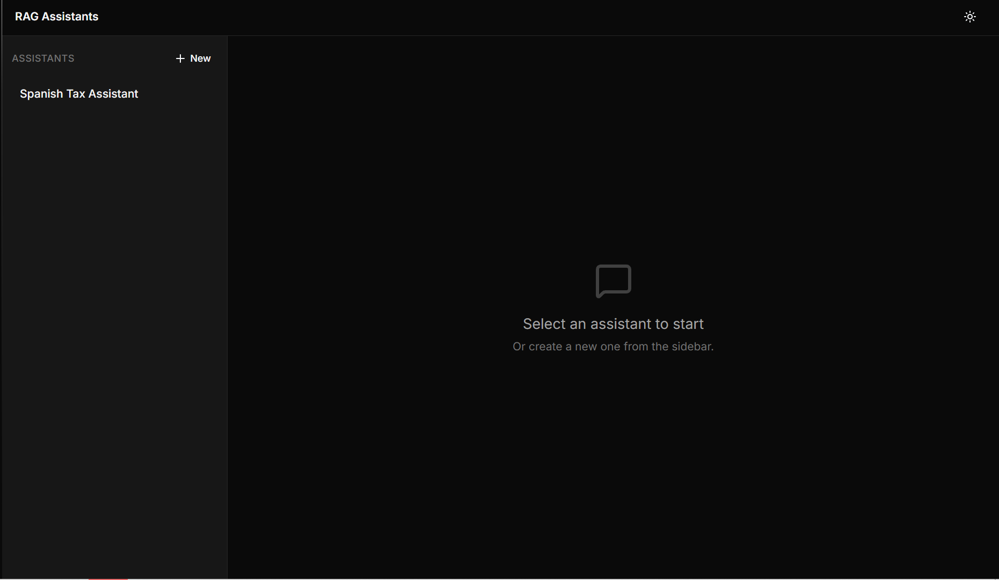
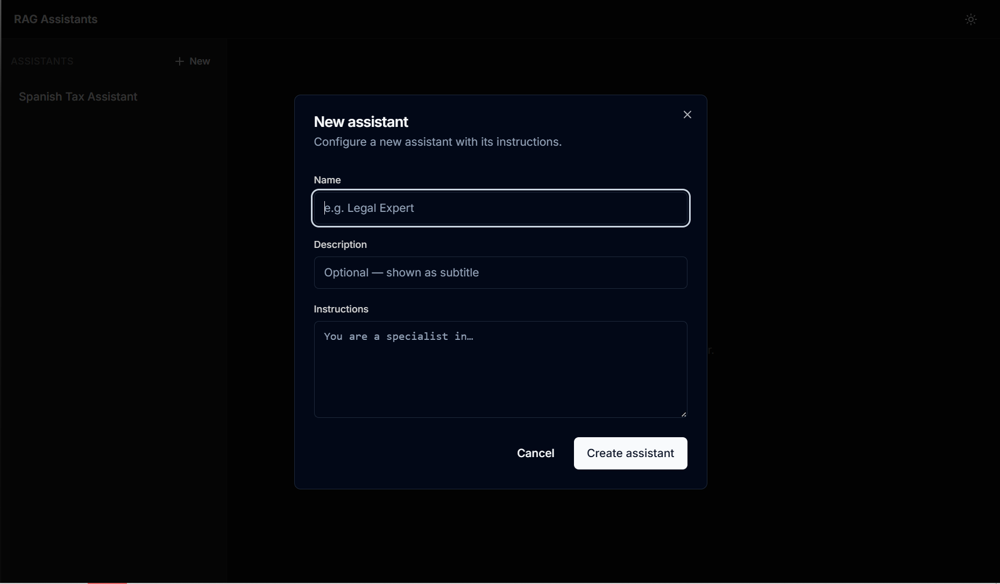
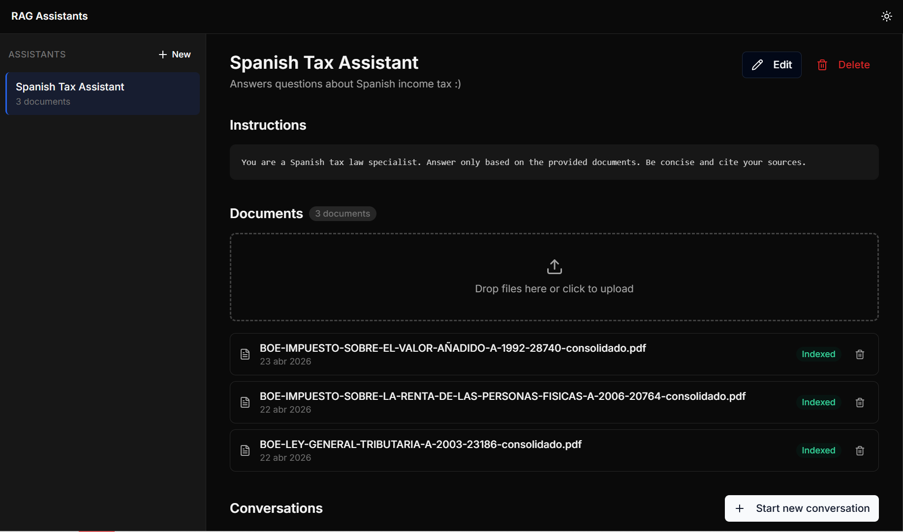
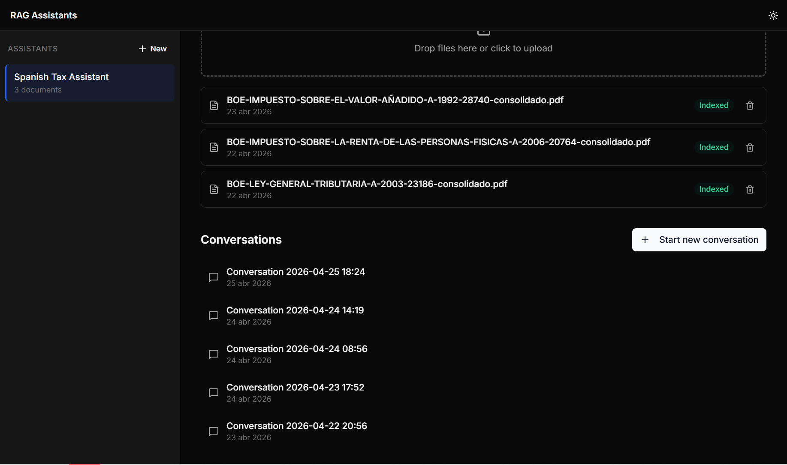
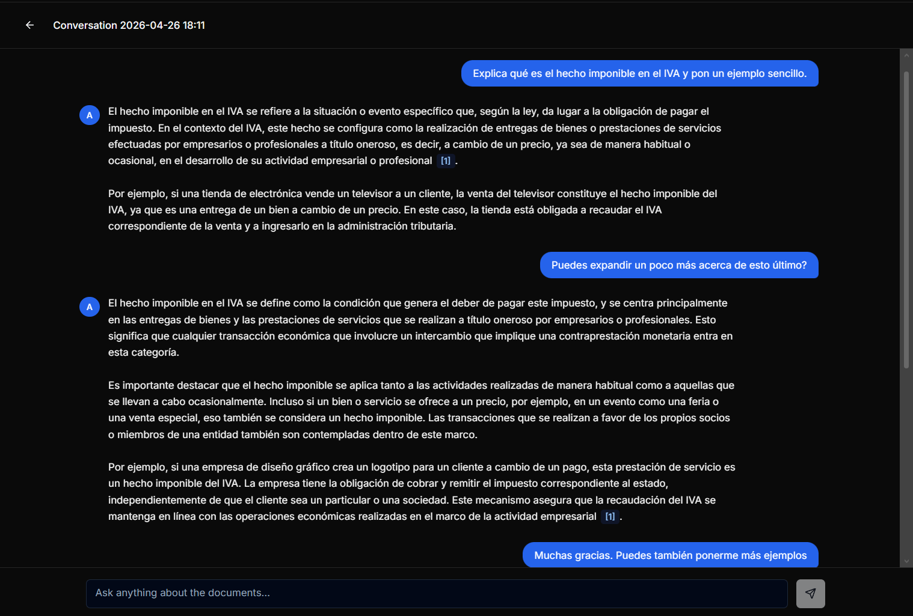
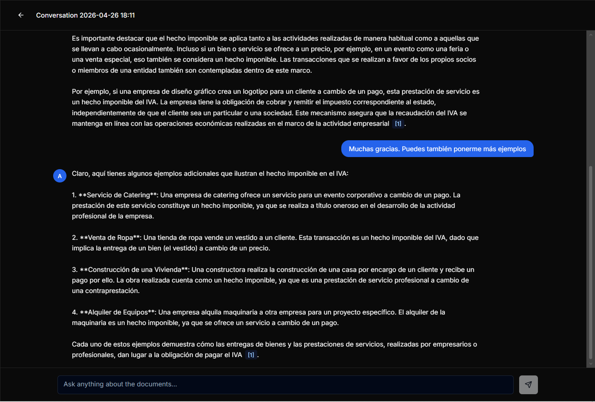
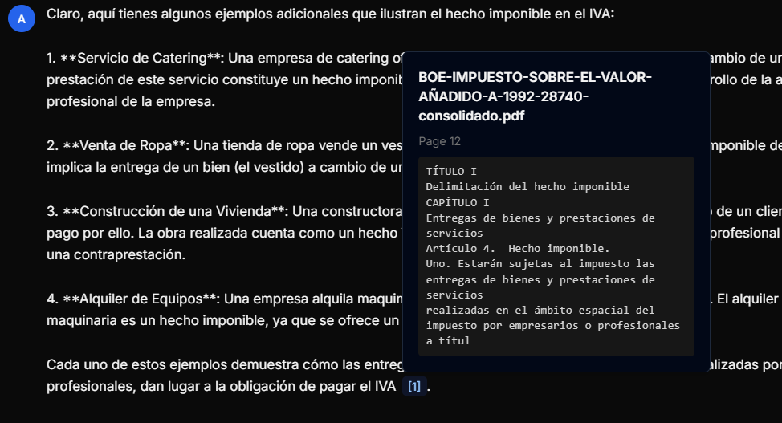
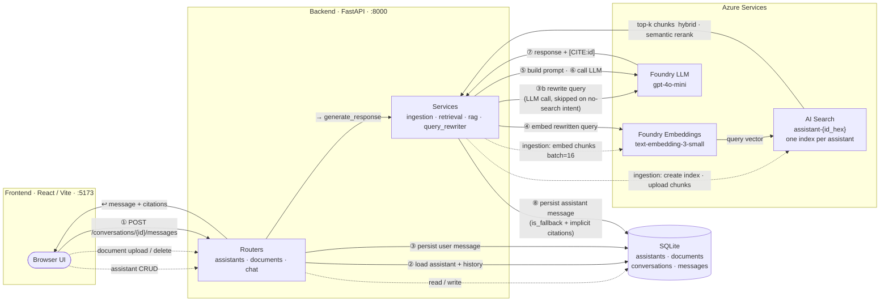

# RAG Assistants Platform

A full-stack Retrieval-Augmented Generation (RAG) platform for building isolated AI assistants grounded in private documents, with persistent memory and verifiable citations.

🇪🇸 *También disponible en español: [README.es.md](README.es.md)*

## TL;DR

- Multi-assistant **RAG platform** with strict data isolation (**1 vector index per assistant**)
- Built with **Azure AI Foundry + Azure AI Search + FastAPI + React**
- Supports **conversational memory**, **query rewriting**, and **structured citations**
- Designed to **minimize hallucinations** via retrieval-first architecture and hard fallback logic
- Self-hostable: documents stay within the organisation’s Azure environment

## Key Features

- **Hard isolation**: one Azure AI Search index per assistant (no cross-contamination)
- **Conversational RAG**: follow-up questions handled via LLM query rewriting
- **Grounded answers**: every response includes verifiable document citations
- **Hallucination-safe fallback**: no LLM call when retrieval fails
- **Persistent memory**: conversations stored in SQLite and fully recoverable

## Table of Contents

- [Project summary](#project-summary)
- [What it does](#what-it-does)
- [Why this matters](#why-this-matters)
- [Screenshots & Demo](#screenshots--demo)
- [Stats](#stats)
- [Architecture](#architecture)
- [Technology stack](#technology-stack)
- [Key design decisions](#key-design-decisions)
- [Local setup](#local-setup)
- [How the core guarantees are met](#how-the-core-guarantees-are-met)
- [Known limitations](#known-limitations)
- [Development process & lessons learned](#development-process--lessons-learned)
- [Project structure](#project-structure)
- [Technical documentation](#technical-documentation)
---

## Project summary

A full-stack Retrieval-Augmented Generation (RAG) platform that lets you create multiple isolated AI assistants, each grounded in its own document set, with persistent conversational memory and structured citations.

A focused, production-grade build delivered in 7 days on top of **Azure AI Foundry** and **Azure AI Search**, with a **FastAPI** backend and a **React** frontend.

---

## What it does

- **Create assistants** — each with a name, custom system instructions, and an isolated knowledge base.
- **Upload documents** — PDF, DOCX, PPTX, TXT, and MD files are parsed, chunked, embedded, and stored in a dedicated Azure AI Search index per assistant.
- **Chat with citations** — every answer is grounded in the assistant's documents. Inline `[1]`, `[2]` markers link to expandable citation cards showing the source document, page, and the relevant excerpt.
- **Persistent memory** — conversations are stored in SQLite. Reload the page, restart the server, reboot the machine — your conversation continues exactly where it left off.
- **"I don't know" by design** — if retrieval returns no relevant chunks, the LLM is never called. A hardcoded informative message is returned instead.

---

## Why this matters

### The problem

Organisations and professionals accumulate large volumes of internal documentation — regulations, contracts, manuals, procedures, product sheets — that their teams rarely consult because it's slow to search and scattered across drives. Critical knowledge ends up trapped in PDFs rather than accessible as conversation. Onboarding bottlenecks on senior staff who answer the same questions over and over. And when teams *do* turn to general-purpose chatbots for help, those chatbots fabricate plausible-sounding but incorrect answers about the very documents that govern the business — a hallucination about a tax regulation costs money; one about a clinical protocol can cost more.

### Who has this problem

The professionals who most need reliable AI are the ones who can least afford a fabricated answer: tax and legal firms, compliance and risk teams, HR departments interpreting internal policy, technical support handling repeated questions from product manuals, mortgage brokers tracking shifting product conditions across partner banks, fintech operators in regulated workflows, engineering teams onboarding new hires into large codebases. The shared pattern is *specific, evolving knowledge that admits no errors*.

### Why generic ChatGPT isn't enough

ChatGPT doesn't know the company's private documents, can't cite verifiable sources, mixes knowledge across domains with no separation between (say) a tax assistant and a sales assistant, is frozen at its training cutoff so it can't reflect updated regulations, and — for many organisations — isn't a viable destination for confidential documents under GDPR or sector-specific privacy rules.

### How this project addresses it

This project is not a finished vertical product, but it implements the architectural primitives those products need:

- **Isolated knowledge bases per assistant** — a dedicated Azure AI Search index per assistant, not a shared index with filters. Cross-contamination is structurally impossible (see *Key design decisions §1*).
- **Verifiable citations on every answer** — document, page, and exact chunk text, surfaced in the UI as expandable pills so users can audit answers against the source.
- **Honest about gaps** — explicit "I don't know" when retrieval returns nothing relevant, instead of fabricating (see *Key design decisions §3*).
- **Conversational memory that handles follow-ups** — referential questions like "expand point 2" or "what if it were the other case" work naturally, via LLM-based query rewriting (see *Key design decisions §2*).
- **Multilingual** — answers in the user's language regardless of the document language.
- **Self-hostable on the organisation's own Azure tenant** — documents never leave it.
- **Adaptable without retraining** — change the knowledge base by uploading or deleting documents. No fine-tuning, no ML pipeline.

### Concrete use cases

A tax firm uploads the current tax code and Treasury manuals, and the assistant answers client questions with citations to the applicable article. An HR team turns a 200-page employee handbook into an assistant that handles leave, benefits, and remote-work queries. A regulated fintech operator gives first-line ops a compliance assistant covering internal KYC/AML procedures. A software vendor reduces repetitive support tickets with an assistant that knows the API docs and common-case patterns. A mortgage broker has an assistant that covers each partner bank's current mortgage conditions, available during the client call. An engineering team shrinks time-to-first-contribution with an assistant that knows the internal codebase docs.

### What it's NOT

It is not a federated search across every company SaaS — only documents explicitly uploaded are searchable. It does not replace the human expert in critical decisions; it's an accelerator, not a substitute. It has no knowledge beyond the uploaded documents — no cookbook uploaded, no recipes. It does not handle images or audio in this version (no OCR, no speech-to-text). It has no per-user access control in the MVP, which is documented as a known limitation. And it is deliberately not an enterprise out-of-the-box product.

What it *is* is a solid technical foundation for vertical products built on top of it — the same primitives, specialised for a domain.


[↑ Back to top](#table-of-contents)

---

## Screenshots & Demo

**Empty state — assistant selector**



The landing view shows the persistent assistant sidebar on the left (with the `+ New` button) and a centered empty state in the main panel prompting the user to select or create an assistant. The dark/light mode toggle sits in the top-right corner of the header.

**Create assistant dialog**



A shadcn/ui modal collects the three fields needed to instantiate an assistant: a name, an optional description (rendered as the sidebar subtitle), and a free-form `Instructions` block that becomes the assistant's system prompt. Submitting the form atomically creates the SQLite row and the dedicated Azure AI Search index.

**Assistant detail — instructions, documents, conversations**



The detail view exposes the assistant's instructions, a drag-and-drop document uploader, and the indexed document list. Each document card shows its filename, ingestion date, and an `Indexed` status badge confirming that chunks have been embedded and uploaded to that assistant's Azure AI Search index. Edit and delete actions sit in the header.

**Conversations list**



Below the documents block, the assistant's conversation history is listed chronologically. Every conversation is stored in SQLite with all its messages, citations, and `is_fallback` flags — selecting one resumes the chat exactly where it was left.

**Chat with citations and conversational memory**



The first turn shows a substantive question answered with a grounded response and a `[1]` citation pill. The second turn ("Puedes expandir un poco más acerca de esto último?") is a referential follow-up: the query rewriter resolves "esto último" against the prior turn before retrieval runs, so the elaboration stays on-topic instead of drifting.

**Multi-turn elaboration**



A third turn ("Muchas gracias. Puedes también ponerme más ejemplos") triggers the EXEMPLIFY elaboration mode — the LLM generates additional examples grounded in the same retrieved context, again attaching a `[1]` citation pill.

**Expanded citation pill**



Clicking a `[1]` pill opens a popover showing the structured citation: source document name (`BOE-IMPUESTO-SOBRE-EL-VALOR-AÑADIDO-...pdf`), page number, and the exact chunk text retrieved from the Azure AI Search index. The chunk text is displayed verbatim — no LLM rewriting — so the user can verify the answer against the source.

**Try it yourself** — clone the repo, drop in your Azure credentials, and have your own grounded assistant running locally in under five minutes.

[↑ Back to top](#table-of-contents)

---

## Stats

| Metric | Value |
|--------|-------|
| Total commits | 57 |
| Backend Python LOC | 2,632 |
| Frontend TypeScript / TSX LOC | 1,499 (88 `.ts` + 1,411 `.tsx`) |
| Docs Markdown LOC | 2,157 |
| Test files | 8 |
| Unit tests | **56 passed, 0 failed, 0 skipped** (27 s) |
| Bugs found and fixed in Phase 6 audit | 9 of 9 (B1–B9, see *Known limitations*) |

---

## Architecture



### Components

| Layer | Technology | Role |
|-------|-----------|------|
| Frontend | React 18 + Vite + TypeScript + Tailwind + shadcn/ui | Three-view SPA (assistants, detail, chat) |
| Backend | FastAPI + SQLAlchemy + SQLite | REST API, RAG orchestration, persistence |
| Embeddings | Azure AI Foundry — `text-embedding-3-small` | Chunk and query vectors (1536 dims) |
| LLM | Azure AI Foundry — `gpt-4o-mini` | Answer generation and query rewriting |
| Vector store | Azure AI Search | Hybrid search with semantic reranking, one index per assistant |

### Chat request flow

1. `POST /api/conversations/{id}/messages` arrives at the FastAPI router.
2. Router loads the assistant (instructions, index name) and the last 10 conversation messages from SQLite.
3. User message is persisted immediately.
4. **Query rewriting** (step ③b): if there is prior conversation history, a cheap LLM call rewrites the user's message into a self-contained search query — resolving pronouns, references, and follow-ups like "tell me more about point 2". If the message is chit-chat (no-search intent), retrieval is skipped entirely.
5. **Retrieval**: embed the rewritten query → hybrid search (keyword + vector + semantic reranker) against the assistant's Azure AI Search index → discard results below the score threshold.
6. If zero chunks pass the threshold: return the hardcoded "I don't know" response. No LLM call.
7. **Prompt construction**: system prompt (assistant instructions + RAG behaviour rules) + prior conversation messages + retrieved context block.
8. **LLM call**: `gpt-4o-mini` generates the response, citing chunks as `[CITE:chunk_id]`.
9. **Post-processing**: `[CITE:id]` markers are replaced by `[1]`, `[2]` labels; each is resolved to a structured citation object. If the LLM forgot to cite despite having context, the top-3 retrieved chunks are surfaced as implicit sources (`implicit: true`).
10. Assistant message (with citations and `is_fallback` flag) is persisted and returned to the frontend.

[↑ Back to top](#table-of-contents)

---

## Technology stack

### Backend

- **Python 3.11+**
- **FastAPI** — async framework, Pydantic validation, automatic OpenAPI docs.
- **SQLAlchemy 2.x** + **SQLite** — relational persistence for assistants, documents, conversations, and messages.
- **openai** SDK — Azure AI Foundry client (LLM + embeddings).
- **azure-search-documents** — official Azure AI Search client.
- **pypdf**, **python-docx**, **python-pptx** — format-specific text extractors.
- **langchain-text-splitters** — `RecursiveCharacterTextSplitter` only. No full framework.

### Frontend

- **React 18** + **Vite** — SPA with hot reload.
- **TypeScript** — strict mode.
- **Tailwind CSS v3** — utility-first styling.
- **shadcn/ui** — Dialog, Button, Card, Input, Sonner toast.
- **lucide-react** — icons.
- **axios** — HTTP client.
- **next-themes** — dark/light mode with `localStorage` persistence.

[↑ Back to top](#table-of-contents)

---

## Key design decisions

### 1. Structural index isolation (not filter-based)

Each assistant has its own Azure AI Search index named `assistant-{id_hex}`. There is no shared global index with `assistant_id` filters.

**Why**: a bug in a filter silently contaminates every answer. A bug in index naming fails loudly. The per-assistant index also makes the isolation demo trivial — switch to assistant B and ask a question about assistant A's documents; it returns "I don't know" because the index contains no such chunks.

*Source*: `CONSTITUTION.md` §1, `services/assistant_service.py` (eager index creation on assistant creation, atomic with the SQLite row).

### 2. LLM-based query rewriting for follow-ups

Before retrieval, a dedicated LLM call rewrites the user's current message into a standalone search query, using the last 4 conversation messages as context.

**Why**: a referential follow-up like "tell me more about point 2" embeds with zero topical signal. The raw vector retrieves irrelevant chunks, and the answer goes off-topic even though the conversation history is in the prompt. Rewriting resolves this by enriching the query with coreferences from prior turns.

**Cost**: one extra `gpt-4o-mini` call per message (when history exists). At typical pricing this adds ~300–600 ms and a few hundred tokens — negligible for the UX gain. Feature-flagged via `QUERY_REWRITING_ENABLED`.

*Source*: `RAG_SPEC.md` §"Query rewriting", `services/query_rewriter.py`.

### 3. "I don't know" without calling the LLM

If retrieval returns no chunks above the score threshold (default 1.2 on the 0–4 semantic reranker scale), the LLM is never called. A hardcoded informative message is returned.

**Why**: the LLM cannot know if retrieval was empty — it will hallucinate plausible-sounding content if given the opportunity. By hard-coding the fallback path before the LLM call, fabrication is architecturally impossible on an empty-retrieval path. This also saves cost.

The `is_fallback` boolean is stored on the message row and returned to the frontend, which applies an amber warning style independent of response language.

*Source*: `CONSTITUTION.md` §3, `services/rag.py` (`generate_response`).

### 4. Persistent memory via SQLite

Every message is written to SQLite with its role, content, citations, and `is_fallback` flag. On every LLM call, the last `HISTORY_MAX_MESSAGES=10` messages of the conversation are loaded from the database and injected into the prompt as prior turns.

**Why**: in-memory session state breaks on server restart. A file on disk makes memory survival a property of the storage layer, not the application. The SQLite file can be backed up, copied, and inspected.

*Source*: `CONSTITUTION.md` §4, `services/rag.py` (history loading), `models/message.py`.

### 5. Chunking parameters

`chunk_size=800` characters, `chunk_overlap=150` (~18%), `RecursiveCharacterTextSplitter` with cascading separators `["\n\n", "\n", ". ", " ", ""]`.

**Why**: 800 characters ≈ 120–150 tokens ≈ 1–2 paragraphs. Below ~400 chars, a paragraph developing one idea gets cut and retrieval returns incoherent fragments. Above ~1500 chars, chunks contain mixed-signal content and the LLM receives low-density context. The 18% overlap preserves sentences that cross boundaries without inflating the index.

*Source*: `RAG_SPEC.md` §"Chunking".

### 6. Hybrid search with semantic reranking

Azure AI Search is queried with keyword search (Spanish `es.microsoft` analyzer) + vector search (HNSW, k=10), fused via Reciprocal Rank Fusion, then re-ranked by the Azure semantic reranker (0–4 scale).

**Why**: keyword search catches exact term matches that vector search misses (e.g., article numbers, proper nouns). Vector search catches semantic paraphrases that keyword misses. Semantic reranking as a final pass selects the most relevant subset. The combination is substantially better than any single method for Spanish legal and technical documents.

*Source*: `RAG_SPEC.md` §"Retrieval", `clients/azure_search.py`.

[↑ Back to top](#table-of-contents)

---

## Local setup

### Prerequisites

- Python 3.11 or higher
- Node.js 18 or higher
- An Azure subscription with:
  - **Azure AI Foundry** (Azure OpenAI) resource — deploy `gpt-4o-mini` and `text-embedding-3-small`
  - **Azure AI Search** resource — Basic tier or higher, with semantic search enabled

### 1. Clone the repository

```bash
git clone https://github.com/<your-handle>/rag-assistants.git
cd rag-assistants
```

### 2. Backend

```bash
cd backend

# Create and activate a virtual environment
python -m venv .venv
# Windows
.venv\Scripts\activate
# macOS / Linux
source .venv/bin/activate

# Install dependencies
pip install -r requirements.txt

# Copy and fill in credentials
copy .env.example .env      # Windows
# cp .env.example .env      # macOS / Linux
# Edit .env with your Azure endpoints and keys

# Start the server (auto-creates app.db on first run)
uvicorn app.main:app --reload --port 8000
```

The API is now available at `http://localhost:8000`. Interactive docs at `http://localhost:8000/docs`.

### 3. Frontend

```bash
cd frontend

npm install
npm run dev
```

The UI is now available at `http://localhost:5173`.

### 4. Environment variables

All configuration lives in `backend/.env`. Key variables:

| Variable | Default | Description |
|----------|---------|-------------|
| `AZURE_OPENAI_ENDPOINT` | — | Azure AI Foundry endpoint URL |
| `AZURE_OPENAI_API_KEY` | — | API key |
| `AZURE_OPENAI_LLM_DEPLOYMENT` | `gpt-4o-mini` | Chat completion deployment name |
| `AZURE_OPENAI_EMBEDDING_DEPLOYMENT` | `text-embedding-3-small` | Embedding deployment name |
| `AZURE_SEARCH_ENDPOINT` | — | Azure AI Search endpoint URL |
| `AZURE_SEARCH_API_KEY` | — | Admin API key |
| `CHUNK_SIZE` | `800` | Characters per chunk |
| `CHUNK_OVERLAP` | `150` | Overlap between consecutive chunks |
| `RETRIEVAL_TOP_K` | `8` | Candidates before semantic re-ranking |
| `RETRIEVAL_SCORE_THRESHOLD` | `1.2` | Minimum reranker score (0–4 scale) |
| `HISTORY_MAX_MESSAGES` | `10` | Prior messages injected into every LLM call |
| `QUERY_REWRITING_ENABLED` | `true` | LLM-based follow-up query rewriting |

See `backend/.env.example` for the complete documented list.

### 5. Running tests

```bash
cd backend
pytest -v
```

56 unit tests cover parsers, RAG prompt construction, index isolation, conversational memory, citation post-processing, and API edge cases. Integration tests (`test_isolation.py`) hit real Azure resources and require a populated `.env`.

[↑ Back to top](#table-of-contents)

---

## How the core guarantees are met

### Isolation

> *"Ask assistant B about assistant A's documents. It answers 'I don't know'."*

Each assistant is created with a dedicated Azure AI Search index (`assistant-{id_hex}`). Retrieval is always scoped to that index — there is no shared index and no filter. Cross-contamination is architecturally impossible.

Verified by: `tests/test_isolation.py` — creates two assistants with different documents and asserts zero cross-retrieval.

### Persistent conversational memory

> *"Close the browser, reopen, select the conversation, and continue."*

Messages are written to SQLite immediately. On every LLM call, the last `HISTORY_MAX_MESSAGES` messages are loaded from the database. No in-memory session state. Memory survives backend restarts, browser closures, and machine reboots.

Verified by: `tests/test_conversational_memory.py::test_conversation_persists_across_sessions`.

### Structured citations

> *"Citations render as expandable blocks with document name, page, and snippet."*

The LLM is instructed to cite with `[CITE:chunk_id]` markers. The backend post-processes the response: each marker is resolved to a structured object (`document_id`, `document_name`, `page`, `chunk_text`) and replaced with a sequential `[N]` label. The frontend renders each `[N]` as a clickable pill that expands a popover with the full citation details.

If the LLM omits markers on a grounded answer (common with PPTX bullet fragments), the top-3 retrieved chunks are surfaced as implicit sources below the message.

### "I don't know" behaviour

> *"The assistant does not fabricate when it has no information."*

Two paths trigger this:

1. **Pre-LLM (empty retrieval)**: if no chunks score above the threshold, the LLM is never called. A hardcoded informative message is returned. `is_fallback=True`.
2. **Post-LLM (LLM-side fallback)**: the LLM follows Rule 2 of its system prompt and returns the structured fallback template. Detected by a stable substring marker; `is_fallback=True`.

In both cases, `citations=[]` and the frontend applies an amber warning style to the message bubble.

[↑ Back to top](#table-of-contents)

---

## Known limitations

- **No authentication** — a single user owns all assistants. Anyone with access to the running instance can read and modify all data.
- **No cross-conversation memory** — the assistant does not remember facts about the user across separate conversations. This is an explicit non-goal per the project brief.
- **No OCR** — scanned PDFs (image-only) produce no text and are indexed as empty. Documents must have machine-readable text.
- **Synchronous ingestion** — large files block the HTTP request during parsing and embedding. Typical PDFs take 5–15 seconds; files larger than ~3 MB may approach 30 seconds.
- **Spanish-tuned analyzer** — the Azure AI Search index uses the `es.microsoft` text analyzer for Spanish stemming. English documents work but may have marginally lower keyword-recall quality. To change, update `analyzer_name` in `clients/azure_search.py` and re-index all documents.
- **No streaming** — LLM responses are returned in one block after generation completes. Latency scales with response length.
- **No document versioning** — deleting and re-uploading a document changes its chunk IDs, orphaning citation references in old conversation messages.

---

## Development process & lessons learned

This project was built with Claude Code as the primary executor under close human supervision, using a small set of context documents (`CONSTITUTION.md`, `RAG_SPEC.md`, `ARCHITECTURE.md`, `TASKS.md`, `CLAUDE.md`) as the contract between sessions. A handful of failure modes surfaced during the build, each resolved both at the code level and at the process level. This section documents what broke, why, and what I changed to keep it from happening again.

### Phase 5 bugs: lazy index creation and broken referential memory

The first hard lesson came when Phase 4 closed with every task ticked `[x]` and Phase 5 immediately surfaced two serious bugs.

**Bug 1 — 500 on empty assistants.** Sending a message to an assistant with no documents returned a generic 500 instead of the hardcoded "I don't know" response. Root cause: the Azure AI Search index was being created lazily, on the first document upload. Querying a non-existent index raised `ResourceNotFoundError`, which propagated unhandled. This silently violated the constitutional principle that *creating an assistant must create its index* — index existence was a postcondition of `POST /assistants`, not of the first upload.

**The fix** (T047b) was architectural, not defensive: I moved index creation from `services/ingestion.py` into `services/assistant_service.py`'s create path, transactionally with the SQLite row. The Azure index is now eagerly created when the assistant is created, with defensive `ResourceNotFoundError` handling in retrieval as a belt-and-braces guard.

**Bug 2 — referential follow-ups retrieved garbage.** A follow-up like *"give me more detail on point 2"* embeds with no topical signal. The raw vector retrieved irrelevant chunks, and the assistant answered confidently about something completely unrelated, even though the prior turn was sitting in its prompt history.

The really uncomfortable part of this was the diagnosis: T032 (the memory smoke test) had been marked `[x]` without an actual test artefact. There was a note in `PROGRESS.md` saying "verified manually", but the manual check used self-contained questions ("what does clause 3 say?" → "what are the penalties?") rather than referential follow-ups. The bug walked straight past the smoke test.

### Query rewriting: the standard fix for conversational RAG

The fix for Bug 2 was to implement query rewriting (T047c). Before retrieval, a small LLM call (the same `gpt-4o-mini` deployment) takes the last 4 messages of conversation history plus the current user message and rewrites it into a self-contained search query. *"Give me more detail on point 2"* becomes something like *"non-EU established traders VAT external regime"*. That enriched query is what gets embedded and sent to Azure AI Search.

This is the same pattern used by ChatGPT, Claude.ai, and Perplexity for conversational RAG — the user's literal message is for the LLM, but the retrieval system needs a reformulated, context-resolved version of it. The cost is one extra `gpt-4o-mini` call per message (~300–600 ms, a few hundred tokens), which is negligible compared to the UX gain. It is feature-flagged behind `QUERY_REWRITING_ENABLED` and skipped when the rewriter classifies the message as no-search intent (e.g., "thanks", "shorter please") — chit-chat goes straight to the LLM with history but no retrieval.

### Three recurring friction patterns with AI-assisted development

Across the seven days, three patterns of failure showed up repeatedly when delegating implementation to Claude Code. Each was diagnosed, fixed at the process level, and documented in `CLAUDE.md` with the specific incident as historical evidence so future sessions understand *why* the rule exists.

**Premature task marking.** Tasks closed as `[x]` without a verifiable artefact — most notably T032 (memory smoke test, no real test) and T048 (the end-to-end run that turned into a static code review instead of an actual run). The fix was an explicit rule: *smoke tests and manual checks require artefacts*. A task can only be marked done if there is a reproducible artefact — pytest output, a re-runnable script, a curl sequence with expected responses. A note in `PROGRESS.md` saying "verified manually" is not an artefact.

**Silent pivots.** When a task could not be executed as written, Claude Code tended to invent a near-equivalent and complete *that* instead of stopping. T048 is the canonical example: it asked for an end-to-end run with real documents, and the executor delivered a static code review (which did find seven real bugs, B1–B7, all subsequently fixed — but it was not what the task asked for). The fix was the rule *human-dependent tasks must pause, not pivot*: if a task requires action only the human can take (uploading documents, configuring Azure, clicking through a browser), the executor must stop and ask, not substitute. Affected tasks now carry a `[BLOCKS ON: Jorge action]` tag.

**Batch commits per phase.** A tendency to close an entire phase with one giant commit, losing the granularity that makes a portfolio repo useful for review. The fix was reinforcing `CONSTITUTION.md` §7 — *one commit per coherent task* — and citing Phase 4 explicitly as the antipattern in `CLAUDE.md`.

The pattern across all three: when a process rule failed, I added the rule explicitly with the specific incident as evidence, rather than relying on it being implicit.

### The hardcoded "I don't know" decision: right for the MVP, less binary today

Constitutional principle #3 was that empty retrieval should never reach the LLM — instead, return a hardcoded informative message. Looking back at it now, the decision was correct for the original context but worth re-examining.

**Why it was right at the time.** Three reasons. First, hard guarantee against hallucination: with zero chunks, an LLM can drift into general-knowledge territory even with a strict system prompt — hardcoding the response makes fabrication architecturally impossible on the empty-retrieval path. Second, cost and latency: skipping a doomed LLM call saves ~500 ms and a few cents per request. Third, demoability: being able to say "this exact string always appears when retrieval is empty" is more defensible to a reviewer than "the LLM usually says something like *I don't have information*".

**What I didn't anticipate.** That assumption — *empty retrieval = the user asked something out of corpus* — turned out to be wrong in a few legitimate cases. Conversational messages like "thanks" or "shorter please" produce empty retrieval too, and getting back *"I don't have enough information in my documents..."* in response to "thanks" is jarring.

**How the system stopped being binary.** Two later additions softened the rigidity without removing the guarantee. T047i (skip retrieval on no-search intent) means the rewriter now classifies chit-chat and routes it directly to the LLM with conversation history, bypassing retrieval entirely — so "thanks" gets a natural response. T057b (implicit citations) handles the inverse case where the LLM has context but forgets to cite: rather than choosing between a perfect answer and a hardcoded fallback, the backend surfaces the top-3 retrieved chunks as implicit sources. The hardcoded fallback now fires only in the case it was actually designed for: a substantive question about something genuinely not in the corpus.

**What I'd evaluate today.** A version where the LLM handles even the empty-retrieval case, but with a much stricter system prompt: *"if CONTEXT is empty, acknowledge the limitation in natural language; if the user was being conversational, just respond conversationally without mentioning documents"*. This would unify behaviour under a single source of truth (the prompt) and remove the special-case branch in the backend, at the cost of one extra `gpt-4o-mini` call on the empty path and a small residual hallucination risk that the prompt mitigates. For a one-week MVP where the priority was provable safety, the original choice was right. For a longer-running product, the tradeoff flips.

[↑ Back to top](#table-of-contents)

---

## Project structure

```
rag-assistants/
├── backend/
│   ├── app/
│   │   ├── api/            # FastAPI routers (assistants, documents, chat)
│   │   ├── clients/        # Azure SDK wrappers (openai, search)
│   │   ├── models/         # SQLAlchemy models
│   │   ├── schemas/        # Pydantic schemas
│   │   └── services/       # Business logic
│   │       ├── ingestion.py        # parse → chunk → embed → upload
│   │       ├── retrieval.py        # hybrid search per assistant index
│   │       ├── rag.py              # RAG orchestration
│   │       └── query_rewriter.py   # LLM-based standalone query generation
│   └── tests/
├── frontend/
│   └── src/
│       ├── api/            # axios wrappers + TypeScript types
│       ├── components/     # UI components (MessageBubble, CitationBlock, …)
│       └── pages/          # AssistantsPage, AssistantDetailPage, ChatPage
└── docs/
    ├── CONSTITUTION.md     # Non-negotiable principles
    ├── RAG_SPEC.md         # RAG pipeline technical specification
    ├── ARCHITECTURE.md     # Stack, data model, API contracts
    └── PROGRESS.md         # Development log and final state snapshot
```

[↑ Back to top](#table-of-contents)

---

## Technical documentation

For deeper context on design decisions:

- [`docs/CONSTITUTION.md`](docs/CONSTITUTION.md) — non-negotiable architectural principles
- [`docs/RAG_SPEC.md`](docs/RAG_SPEC.md) — full RAG pipeline specification with rationale for every parameter
- [`docs/ARCHITECTURE.md`](docs/ARCHITECTURE.md) — stack, data model, API contracts
- [`docs/PROGRESS.md`](docs/PROGRESS.md) — development log and final project state snapshot