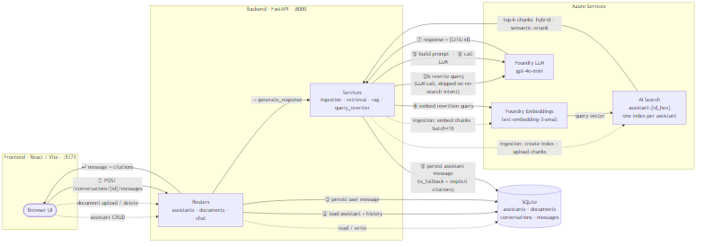

# RAG Assistants Platform

A full-stack Retrieval-Augmented Generation (RAG) platform that lets you create multiple isolated AI assistants, each grounded in its own document set, with persistent conversational memory and structured citations.

Built as a university project in 7 days on top of **Azure AI Foundry** and **Azure AI Search**, with a **FastAPI** backend and a **React** frontend.

---

## What it does

- **Create assistants** — each with a name, custom system instructions, and an isolated knowledge base.
- **Upload documents** — PDF, DOCX, PPTX, TXT, and MD files are parsed, chunked, embedded, and stored in a dedicated Azure AI Search index per assistant.
- **Chat with citations** — every answer is grounded in the assistant's documents. Inline `[1]`, `[2]` markers link to expandable citation cards showing the source document, page, and the relevant excerpt.
- **Persistent memory** — conversations are stored in SQLite. Reload the page, restart the server, reboot the machine — your conversation continues exactly where it left off.
- **"I don't know" by design** — if retrieval returns no relevant chunks, the LLM is never called. A hardcoded informative message is returned instead.

---

## Architecture



### Components

| Layer | Technology | Role |
|-------|-----------|------|
| Frontend | React 18 + Vite + TypeScript + Tailwind + shadcn/ui | Three-view SPA (assistants, detail, chat) |
| Backend | FastAPI + SQLAlchemy + SQLite | REST API, RAG orchestration, persistence |
| Embeddings | Azure AI Foundry — `text-embedding-3-small` | Chunk and query vectors (1536 dims) |
| LLM | Azure AI Foundry — `gpt-4o-mini` | Answer generation and query rewriting |
| Vector store | Azure AI Search | Hybrid search with semantic reranking, one index per assistant |

### Chat request flow

1. `POST /api/conversations/{id}/messages` arrives at the FastAPI router.
2. Router loads the assistant (instructions, index name) and the last 10 conversation messages from SQLite.
3. User message is persisted immediately.
4. **Query rewriting** (step ③b): if there is prior conversation history, a cheap LLM call rewrites the user's message into a self-contained search query — resolving pronouns, references, and follow-ups like "tell me more about point 2". If the message is chit-chat (no-search intent), retrieval is skipped entirely.
5. **Retrieval**: embed the rewritten query → hybrid search (keyword + vector + semantic reranker) against the assistant's Azure AI Search index → discard results below the score threshold.
6. If zero chunks pass the threshold: return the hardcoded "I don't know" response. No LLM call.
7. **Prompt construction**: system prompt (assistant instructions + RAG behaviour rules) + prior conversation messages + retrieved context block.
8. **LLM call**: `gpt-4o-mini` generates the response, citing chunks as `[CITE:chunk_id]`.
9. **Post-processing**: `[CITE:id]` markers are replaced by `[1]`, `[2]` labels; each is resolved to a structured citation object. If the LLM forgot to cite despite having context, the top-3 retrieved chunks are surfaced as implicit sources (`implicit: true`).
10. Assistant message (with citations and `is_fallback` flag) is persisted and returned to the frontend.

---

## Technology stack

### Backend

- **Python 3.11+**
- **FastAPI** — async framework, Pydantic validation, automatic OpenAPI docs.
- **SQLAlchemy 2.x** + **SQLite** — relational persistence for assistants, documents, conversations, and messages.
- **openai** SDK — Azure AI Foundry client (LLM + embeddings).
- **azure-search-documents** — official Azure AI Search client.
- **pypdf**, **python-docx**, **python-pptx** — format-specific text extractors.
- **langchain-text-splitters** — `RecursiveCharacterTextSplitter` only. No full framework.

### Frontend

- **React 18** + **Vite** — SPA with hot reload.
- **TypeScript** — strict mode.
- **Tailwind CSS v3** — utility-first styling.
- **shadcn/ui** — Dialog, Button, Card, Input, Sonner toast.
- **lucide-react** — icons.
- **axios** — HTTP client.
- **next-themes** — dark/light mode with `localStorage` persistence.

---

## Key design decisions

### 1. Structural index isolation (not filter-based)

Each assistant has its own Azure AI Search index named `assistant-{id_hex}`. There is no shared global index with `assistant_id` filters.

**Why**: a bug in a filter silently contaminates every answer. A bug in index naming fails loudly. The per-assistant index also makes the isolation demo trivial — switch to assistant B and ask a question about assistant A's documents; it returns "I don't know" because the index contains no such chunks.

*Source*: `CONSTITUTION.md` §1, `services/assistant_service.py` (eager index creation on assistant creation, atomic with the SQLite row).

### 2. LLM-based query rewriting for follow-ups

Before retrieval, a dedicated LLM call rewrites the user's current message into a standalone search query, using the last 4 conversation messages as context.

**Why**: a referential follow-up like "tell me more about point 2" embeds with zero topical signal. The raw vector retrieves irrelevant chunks, and the answer goes off-topic even though the conversation history is in the prompt. Rewriting resolves this by enriching the query with coreferences from prior turns.

**Cost**: one extra `gpt-4o-mini` call per message (when history exists). At typical pricing this adds ~300–600 ms and a few hundred tokens — negligible for the UX gain. Feature-flagged via `QUERY_REWRITING_ENABLED`.

*Source*: `RAG_SPEC.md` §"Query rewriting", `services/query_rewriter.py`.

### 3. "I don't know" without calling the LLM

If retrieval returns no chunks above the score threshold (default 1.2 on the 0–4 semantic reranker scale), the LLM is never called. A hardcoded informative message is returned.

**Why**: the LLM cannot know if retrieval was empty — it will hallucinate plausible-sounding content if given the opportunity. By hard-coding the fallback path before the LLM call, fabrication is architecturally impossible on an empty-retrieval path. This also saves cost.

The `is_fallback` boolean is stored on the message row and returned to the frontend, which applies an amber warning style independent of response language.

*Source*: `CONSTITUTION.md` §3, `services/rag.py` (`generate_response`).

### 4. Persistent memory via SQLite

Every message is written to SQLite with its role, content, citations, and `is_fallback` flag. On every LLM call, the last `HISTORY_MAX_MESSAGES=10` messages of the conversation are loaded from the database and injected into the prompt as prior turns.

**Why**: in-memory session state breaks on server restart. A file on disk makes memory survival a property of the storage layer, not the application. The SQLite file can be backed up, copied, and inspected.

*Source*: `CONSTITUTION.md` §4, `services/rag.py` (history loading), `models/message.py`.

### 5. Chunking parameters

`chunk_size=800` characters, `chunk_overlap=150` (~18%), `RecursiveCharacterTextSplitter` with cascading separators `["\n\n", "\n", ". ", " ", ""]`.

**Why**: 800 characters ≈ 120–150 tokens ≈ 1–2 paragraphs. Below ~400 chars, a paragraph developing one idea gets cut and retrieval returns incoherent fragments. Above ~1500 chars, chunks contain mixed-signal content and the LLM receives low-density context. The 18% overlap preserves sentences that cross boundaries without inflating the index.

*Source*: `RAG_SPEC.md` §"Chunking".

### 6. Hybrid search with semantic reranking

Azure AI Search is queried with keyword search (Spanish `es.microsoft` analyzer) + vector search (HNSW, k=10), fused via Reciprocal Rank Fusion, then re-ranked by the Azure semantic reranker (0–4 scale).

**Why**: keyword search catches exact term matches that vector search misses (e.g., article numbers, proper nouns). Vector search catches semantic paraphrases that keyword misses. Semantic reranking as a final pass selects the most relevant subset. The combination is substantially better than any single method for Spanish legal and technical documents.

*Source*: `RAG_SPEC.md` §"Retrieval", `clients/azure_search.py`.

---

## Local setup

### Prerequisites

- Python 3.11 or higher
- Node.js 18 or higher
- An Azure subscription with:
  - **Azure AI Foundry** (Azure OpenAI) resource — deploy `gpt-4o-mini` and `text-embedding-3-small`
  - **Azure AI Search** resource — Basic tier or higher, with semantic search enabled

### 1. Clone the repository

```bash
git clone https://github.com/<your-handle>/rag-assistants.git
cd rag-assistants
```

### 2. Backend

```bash
cd backend

# Create and activate a virtual environment
python -m venv .venv
# Windows
.venv\Scripts\activate
# macOS / Linux
source .venv/bin/activate

# Install dependencies
pip install -r requirements.txt

# Copy and fill in credentials
copy .env.example .env      # Windows
# cp .env.example .env      # macOS / Linux
# Edit .env with your Azure endpoints and keys

# Start the server (auto-creates app.db on first run)
uvicorn app.main:app --reload --port 8000
```

The API is now available at `http://localhost:8000`. Interactive docs at `http://localhost:8000/docs`.

### 3. Frontend

```bash
cd frontend

npm install
npm run dev
```

The UI is now available at `http://localhost:5173`.

### 4. Environment variables

All configuration lives in `backend/.env`. Key variables:

| Variable | Default | Description |
|----------|---------|-------------|
| `AZURE_OPENAI_ENDPOINT` | — | Azure AI Foundry endpoint URL |
| `AZURE_OPENAI_API_KEY` | — | API key |
| `AZURE_OPENAI_LLM_DEPLOYMENT` | `gpt-4o-mini` | Chat completion deployment name |
| `AZURE_OPENAI_EMBEDDING_DEPLOYMENT` | `text-embedding-3-small` | Embedding deployment name |
| `AZURE_SEARCH_ENDPOINT` | — | Azure AI Search endpoint URL |
| `AZURE_SEARCH_API_KEY` | — | Admin API key |
| `CHUNK_SIZE` | `800` | Characters per chunk |
| `CHUNK_OVERLAP` | `150` | Overlap between consecutive chunks |
| `RETRIEVAL_TOP_K` | `8` | Candidates before semantic re-ranking |
| `RETRIEVAL_SCORE_THRESHOLD` | `1.2` | Minimum reranker score (0–4 scale) |
| `HISTORY_MAX_MESSAGES` | `10` | Prior messages injected into every LLM call |
| `QUERY_REWRITING_ENABLED` | `true` | LLM-based follow-up query rewriting |

See `backend/.env.example` for the complete documented list.

### 5. Running tests

```bash
cd backend
pytest -v
```

56 unit tests cover parsers, RAG prompt construction, index isolation, conversational memory, citation post-processing, and API edge cases. Integration tests (`test_isolation.py`) hit real Azure resources and require a populated `.env`.

---

## How the core guarantees are met

### Isolation

> *"Ask assistant B about assistant A's documents. It answers 'I don't know'."*

Each assistant is created with a dedicated Azure AI Search index (`assistant-{id_hex}`). Retrieval is always scoped to that index — there is no shared index and no filter. Cross-contamination is architecturally impossible.

Verified by: `tests/test_isolation.py` — creates two assistants with different documents and asserts zero cross-retrieval.

### Persistent conversational memory

> *"Close the browser, reopen, select the conversation, and continue."*

Messages are written to SQLite immediately. On every LLM call, the last `HISTORY_MAX_MESSAGES` messages are loaded from the database. No in-memory session state. Memory survives backend restarts, browser closures, and machine reboots.

Verified by: `tests/test_conversational_memory.py::test_conversation_persists_across_sessions`.

### Structured citations

> *"Citations render as expandable blocks with document name, page, and snippet."*

The LLM is instructed to cite with `[CITE:chunk_id]` markers. The backend post-processes the response: each marker is resolved to a structured object (`document_id`, `document_name`, `page`, `chunk_text`) and replaced with a sequential `[N]` label. The frontend renders each `[N]` as a clickable pill that expands a popover with the full citation details.

If the LLM omits markers on a grounded answer (common with PPTX bullet fragments), the top-3 retrieved chunks are surfaced as implicit sources below the message.

### "I don't know" behaviour

> *"The assistant does not fabricate when it has no information."*

Two paths trigger this:

1. **Pre-LLM (empty retrieval)**: if no chunks score above the threshold, the LLM is never called. A hardcoded informative message is returned. `is_fallback=True`.
2. **Post-LLM (LLM-side fallback)**: the LLM follows Rule 2 of its system prompt and returns the structured fallback template. Detected by a stable substring marker; `is_fallback=True`.

In both cases, `citations=[]` and the frontend applies an amber warning style to the message bubble.

---

## Known limitations

- **No authentication** — a single user owns all assistants. Anyone with access to the running instance can read and modify all data.
- **No cross-conversation memory** — the assistant does not remember facts about the user across separate conversations. This is an explicit non-goal per the project brief.
- **No OCR** — scanned PDFs (image-only) produce no text and are indexed as empty. Documents must have machine-readable text.
- **Synchronous ingestion** — large files block the HTTP request during parsing and embedding. Typical PDFs take 5–15 seconds; files larger than ~3 MB may approach 30 seconds.
- **Spanish-tuned analyzer** — the Azure AI Search index uses the `es.microsoft` text analyzer for Spanish stemming. English documents work but may have marginally lower keyword-recall quality. To change, update `analyzer_name` in `clients/azure_search.py` and re-index all documents.
- **No streaming** — LLM responses are returned in one block after generation completes. Latency scales with response length.
- **No document versioning** — deleting and re-uploading a document changes its chunk IDs, orphaning citation references in old conversation messages.

---

## Project structure

```
rag-assistants/
├── backend/
│   ├── app/
│   │   ├── api/            # FastAPI routers (assistants, documents, chat)
│   │   ├── clients/        # Azure SDK wrappers (openai, search)
│   │   ├── models/         # SQLAlchemy models
│   │   ├── schemas/        # Pydantic schemas
│   │   └── services/       # Business logic
│   │       ├── ingestion.py        # parse → chunk → embed → upload
│   │       ├── retrieval.py        # hybrid search per assistant index
│   │       ├── rag.py              # RAG orchestration
│   │       └── query_rewriter.py   # LLM-based standalone query generation
│   └── tests/
├── frontend/
│   └── src/
│       ├── api/            # axios wrappers + TypeScript types
│       ├── components/     # UI components (MessageBubble, CitationBlock, …)
│       └── pages/          # AssistantsPage, AssistantDetailPage, ChatPage
└── docs/
    ├── CONSTITUTION.md     # Non-negotiable principles
    ├── RAG_SPEC.md         # RAG pipeline technical specification
    ├── ARCHITECTURE.md     # Stack, data model, API contracts
    └── PROGRESS.md         # Development log and final state snapshot
```

---

## Technical documentation

For deeper context on design decisions:

- [`docs/CONSTITUTION.md`](docs/CONSTITUTION.md) — non-negotiable architectural principles
- [`docs/RAG_SPEC.md`](docs/RAG_SPEC.md) — full RAG pipeline specification with rationale for every parameter
- [`docs/ARCHITECTURE.md`](docs/ARCHITECTURE.md) — stack, data model, API contracts
- [`docs/PROGRESS.md`](docs/PROGRESS.md) — development log and final project state snapshot

---

*See [`README.es.md`](README.es.md) for a Spanish-language summary.*
